# Career Tracker App
## Introduction
The Career Tracker App is a web app designed to help users track their career progress, set goals
and manage their professional development. 
The app provides tracking of daily activities, enabling users to keep a record and stay on track.

### TARGET AUDIENCE
The app is ideal for all professionals who want to monitor their career growth,
although it is particularly designed with apprentices and those in their early career in mind.

___

## ❗️To run the app...

### 1. **Download the ZIP file or clone the repository**
*See instructions for cloning: https://docs.github.com/en/repositories/creating-and-managing-repositories/cloning-a-repository*

*GitHub repository link: https://github.com/raven-elizabeth/Career_Tracker_App*
### 2. **Install the required dependencies** using `pip install -r requirements.txt`
### 3. **Run the Flask api** using `python -m api.api` (<u>**keep it running - without this the app WILL NOT WORK**</u>)
### 4. **Run the main app in a separate terminal** by using `python main.py`

#### *NOTE: You can also run the files directly in your IDE if you prefer, just make sure to run `api.py` first and keep it running before running `main.py`.*
#### *NOTE: I have set the debug mode to 'False' in `api/api.py` to simulate a production environment, where you would want to avoid security risks. If you want to view the console logs, change `debug=False` to `debug=True`*

___

## Sample entry data:
I have included two sample entries in `data/entries.csv` to demonstrate the app's functionality.
The dates of these entries are:
## `2026-02-23`
```
DATE: 2026-02-23
WORK CONTRIBUTION: Completed .NET10 updates
LEARNING: Researched Spiral Methodology
WIN: Implemented design pattern knowledge
CHALLENGE: Debugging CORS issues
NEXT STEPS: Refine uni project!
```
## `2026-02-25`
```
DATE: 2026-02-25
WORK CONTRIBUTION:
LEARNING: Learnt about user stories & personas
WIN:
CHALLENGE: Debugging pandas dataframe!
NEXT STEPS:
```

You can use these dates to test the search, update, and delete functionality of the app.
To test the creation of new entries, simply use the "New Entry" screen to add an entry for a new date.
___

## Endpoints

<br>

GET: `http://127.0.0.1:5000/api/csv/entries/<date>`

Gets the entry for the specified date. 

If no entry exists, it returns a message indicating that no entry was found rather than raising. 
``` 
200: Entry found and returned successfully.
404: No entry found for the specified date.
503: Server error; file unavailable. 
```

DELETE: `http://127.0.0.1:5000/api/csv/entries/<date>`

Deletes the entry for the specified date. Raises an error if no entry exists for that date.
```
204 - Entry deleted successfully.
404 - No entry found for the specified date.
503 - Server error; file unavailable.
```

<br>

### Following endpoints require JSON body with the date and at least one field value:

<br>

POST: `http://127.0.0.1:5000/api/csv/entries`

Saves a new entry for the specified date. Raises an error if entry already exists for that date.
```
201 - Entry created successfully.
400 - Bad request; missing required fields or invalid data format.
409 - Conflict; entry already exists for the specified date.
```

PUT: `http://127.0.0.1:5000/api/csv/entries/<date>`

Replaces the entry for the specified date with the new data provided. 
Raises an error if no entry exists for that date.
```
200 - Entry updated successfully.
400 - Bad request; missing required fields or invalid data format.
404 - No entry found for the specified date.
503 - Server error; file unavailable.
```

PATCH: `http://127.0.0.1:5000/api/csv/entries/<date>`

Partially updates the entry for the specified date with the new data provided.
Raises an error if no entry exists for that date.
```
200 - Entry updated successfully.
400 - Bad request; missing required fields or invalid data format.
404 - No entry found for the specified date.
503 - Server error; file unavailable.
```
___

## Libraries & Tools Used

### Language
- **Python** — The programming language used for both the API and GUI.

### API
- **Flask** — Micro web framework used to build and serve the REST API (`api/api.py`). Chosen for its simplicity and familiarity.
- **Requests** — HTTP client library used by the API client (`gui/api_client/client.py`) to make GET, POST, PUT, PATCH, and DELETE requests to the Flask API.

### GUI
- **Tkinter** — Python's built-in GUI library, used to build all screens(`gui/`). Chosen for its availability as a standard library with no extra install required.
- **Tkcalendar** — Third-party calendar widget for Tkinter, used in the search and new entry screens to allow date selection.

### Data
- **Pandas** — Data manipulation library used in the CSV repository (`data_access/repositories/csv_database_repository.py`) for reading, writing, and indexing CSV data. Date indexing provides O(1) lookups.
- **CSV** — File format used for persistent data storage (`data/entries.csv`). Chosen for simplicity; no database server setup required.

### Testing
- **unittest** — Python's built-in testing framework, used to write all tests across `tests/`.
- **pytest** — Used as the test runner (e.g. by PyCharm). Tests are written in `unittest` style but discovered and run by pytest.
- **unittest.mock** — Used in `client_test.py` to mock HTTP responses from the API without needing a running server.

### Logging
- **logging** — Python's built-in logging module, configured in `logs/logging_config.py` and used across the API, repository, and client for debug, info, warning, and error logs.

### Project Management & Version Control
- **Jira** — Used to track epics and tasks during development.
- **GitHub** — Used for version control and to host the repository.
- **Canva** — Used to create the project poster and diagrams included in the documentation.
- **FigmaMake** - Used to design the wireframe mockups for the GUI screens before implementation.

___

### Dependencies
The following are transitive dependencies installed automatically with the above libraries.
They are pinned in `requirements.txt` for reproducibility but are not used directly in the codebase:

| Library | Transitive Dependencies |
| --- | --- |
| Flask | werkzeug, jinja2, markupsafe, itsdangerous, blinker, click, colorama |
| requests | certifi, charset-normalizer, idna, urllib3 |
| pandas | numpy, python-dateutil, tzdata, six |
| tkcalendar | babel |
| pytest | colorama, iniconfig, packaging, pluggy, pygments |

___
## Running Tests
Tests are written using Python's built-in `unittest` framework. `pytest` is included as a dependency 
as it is used as the test runner (e.g. by PyCharm, which I used). There are three ways to run them:

- **Run all tests at once** from the project root:
  ```
  python -m unittest discover -s tests -p "*_test.py" --top-level-dir .
  ```

- **Run a specific test file** from the project root:
  
  `python -m unittest tests.api_tests.api_test`
  
  `python -m unittest tests.api_tests.client_test`

  `python -m unittest tests.database_tests.csv_database_repository_test`

  `python -m unittest tests.domain_tests.entry_test`

- **Run a test file directly** (e.g. in an IDE or from its own directory):
  Each test file can be run directly as a script, e.g. `python api_test.py`
___

## Examples of Use

### Home Screen
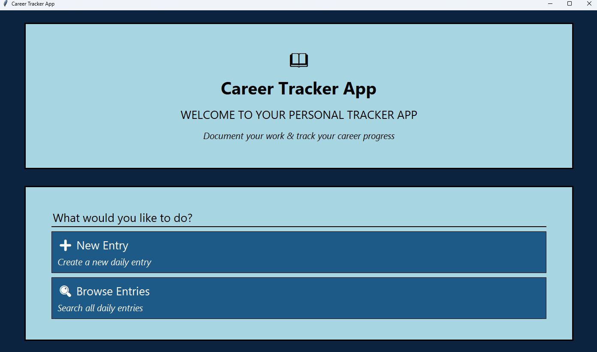

The home screen on launch, showing the main heading, welcome message, and navigation buttons for creating a new entry or searching existing entries.

___

### Creating a New Entry
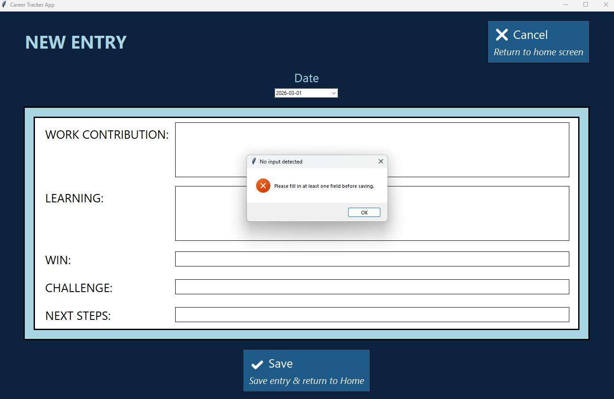

Attempting to save a new entry with no field data filled in — the app prevents this and shows a validation message.

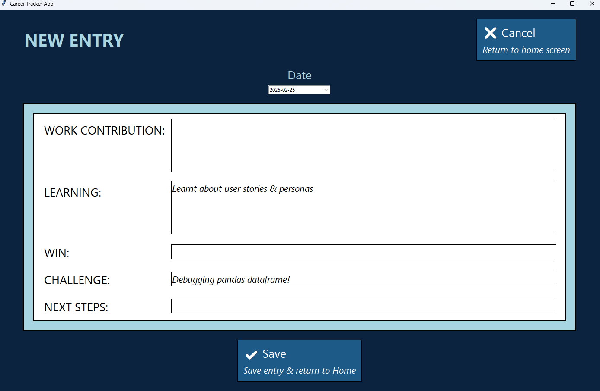

The new entry screen with some fields filled in, ready to be saved.


### Reading an Entry

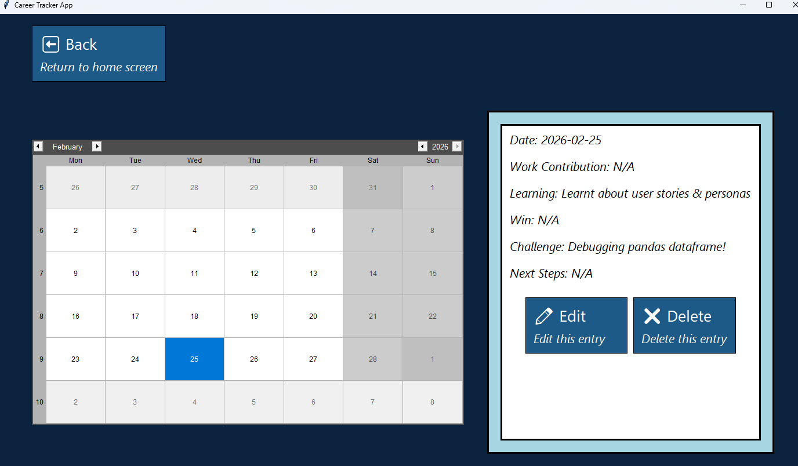

The search screen showing the retrieved entry after saving a new entry, confirming the data was saved and can be retrieved successfully.

___

### Updating an Entry
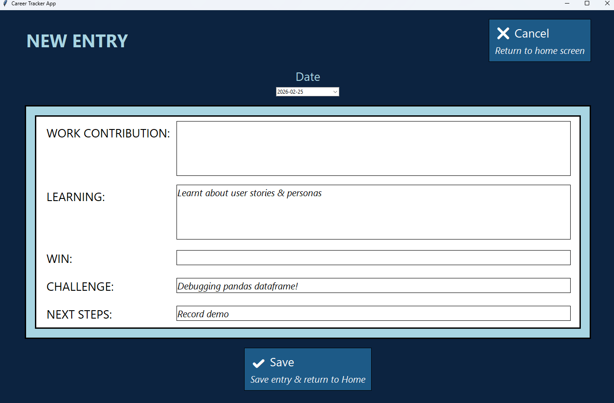

The new entry screen of a previously saved entry being edited.

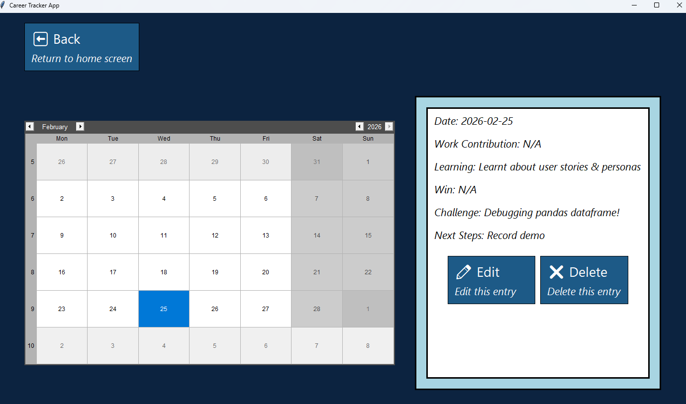

The search screen showing the retrieved entry including the updated data after editing.

___

### Deleting an Entry
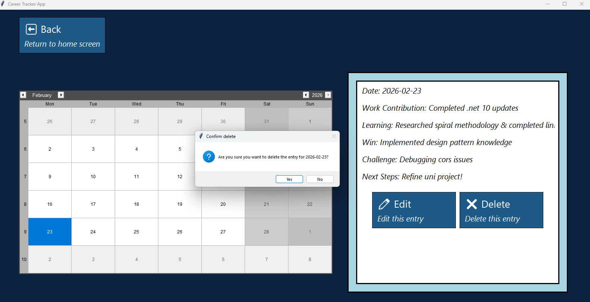

The search screen with the delete button visible for a retrieved entry, ready to be deleted.

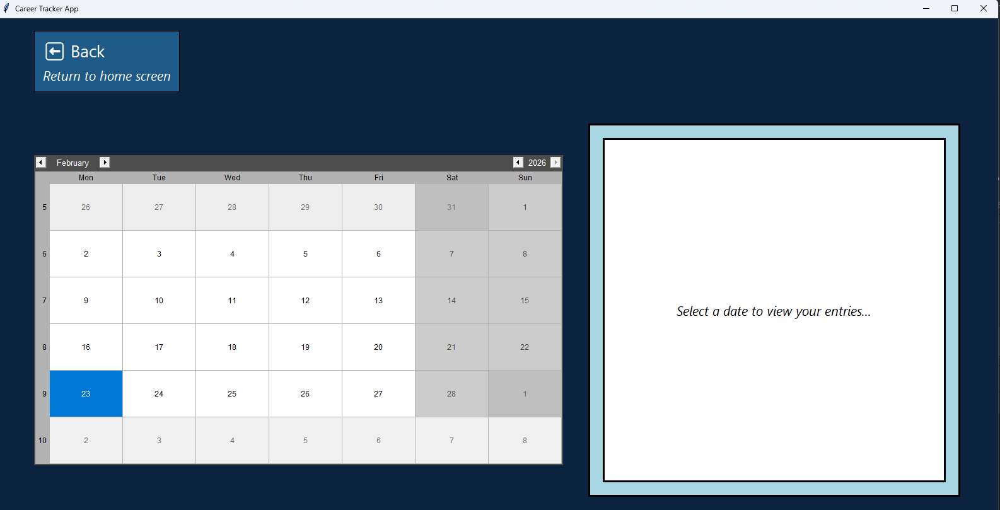

After deletion, the entry is no longer retrievable — the search screen shows the default empty state for the selected date, confirming the entry was removed.

___

### API Log Evidence
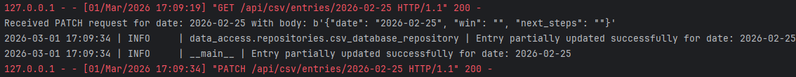

Flask API logs showing a successful PATCH request — only the provided fields were updated, leaving unchanged fields intact.

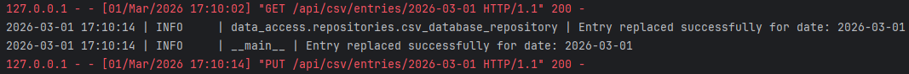

Flask API logs showing a successful PUT request — all fields replaced with the new data provided.

___

## Architecture
### N-Tier Architecture
The app follows an N-Tier architecture, separating the GUI (presentation), 
API & domain logic (application/business), and CSV repository & file (data) into distinct layers.
This promotes separation of concerns, making the codebase easier to understand and maintain.
Each layer has a single responsibility, and changes in one layer 
(e.g. switching from CSV to SQL) will not affect the others.

The app is split into two core processes: a **Flask REST API** (`api/api.py`) and a **Tkinter GUI** (`main.py`).
The GUI never accesses the CSV data directly — all data operations go through HTTP requests via 
`ApiClient` (`gui/api_client/client.py`).
Similarly, the Flask API never accesses the CSV file directly — it interacts with an implementation
of the `DatabaseRepository` interface (`CsvDatabaseRepository`), 
which abstracts away the storage mechanism.
This separation means the backend could be replaced or extended independently of the frontend, 
and the API could be consumed by other clients in the future.

### Repository Pattern
Data access is abstracted behind a `DatabaseRepository` ABC (`data_access/repositories/database_repository.py`), 
with `CsvDatabaseRepository` as the concrete implementation.
This means the storage mechanism (CSV, SQL, etc.) can be swapped without changing any API or domain code 
— only a new repository class would be needed.
The repository is injected into the API via dependency injection, which also makes it easy to pass 
a temporary test file in during testing without modifying production code.

### Domain Model
`DailyEntry` (`domain/dailyentry.py`) is the single representation of an entry throughout the app.
Fields are defined separately in `domain/fields.py`, meaning adding a new field only requires updating one place and all other code (entry construction, CSV headers, GUI display) adapts automatically.
Named constructors (`from_create_entry_request`, `from_replace_request`, `from_partial_update_request`) enforce the correct validation rules per operation at the domain level, keeping the API routes clean.

### GUI Structure
All screens inherit from a shared `Screen` base class (`gui/screens/screen.py`), which provides reusable methods for creating frames, labels, buttons, and separators.
Navigation is managed centrally in `App` (`main.py`) — screens do not navigate to each other directly.
Instead, screens receive callback functions (e.g. `on_home`, `on_edit`) at construction time, keeping screens decoupled from each other and from `App`.

### CSV as Data Storage
A CSV file (`data/entries.csv`) was chosen for storage due to its simplicity — 
no database server setup is required for the app to run, and I am familiar with CSV files vs something like SQLite.
Pandas library is used to read and write the CSV, with the date set as the DataFrame index for O(1) lookups by date.
The file is initialised with headers on first run if it does not already exist.

### Logging
A centralised logger (`logs/logging_config.py`) is used across the API, repository, and client.
This provides a consistent log format and single configuration point. Logs are written to both the console 
and `logs/app.log`, making it easy to trace request flow across the two processes.
Only INFO and above are logged to the console to avoid clutter. 
DEBUG logs are available in the file for deeper troubleshooting when needed.

### Testing Strategy
Tests are written using Python's `unittest` framework and are organised by layer — `api_tests`, `database_tests`, and `domain_tests` — reflecting the separation of concerns in the codebase.
The API tests use Flask's built-in `test_client()` and a temporary file for isolation.
The client tests use `unittest.mock` to simulate HTTP responses without requiring a running server.
This means all tests can be run without starting the Flask API.

---

## Diagrams

**N-Tier Architecture**

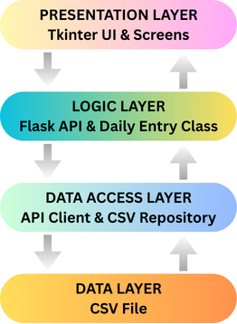

The app follows an N-Tier architecture, separating the GUI (presentation), 
API (application logic) & Daily Entry class (business logic), and CSV file (data) into distinct layers.

**General Sequence Flow**

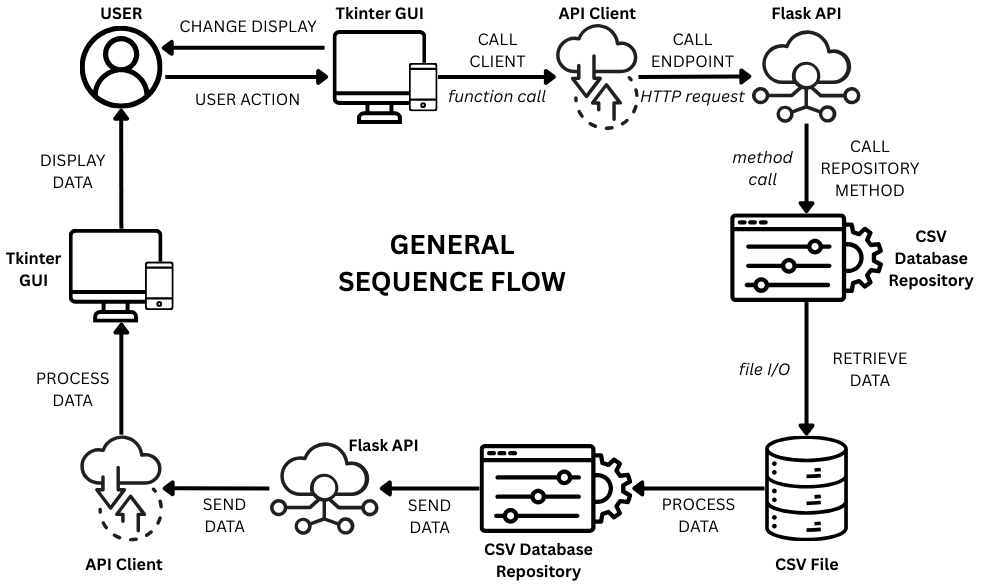

A sequence diagram showing the general flow of a request from the GUI through the API client, Flask API, and repository, and back.

**Alternate Architecture Diagram**

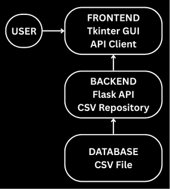

An alternate diagram representing the architecture with a focus on
the upwards flow of data from the CSV file to the GUI, and the user interaction that triggers it.

___

## Future Improvements

In the future, I would consider implementing more features, such as **goal setting**, **progress visualization**,
and a **to-do list**. I could also explore **integrating** with other platforms (e.g., LinkedIn) to automatically 
track career milestones and achievements.

I would like to add a `get_all_entries` endpoint to the API to allow retrieval of all entries at once,
which could have multiple benefits, including enabling date colour-coding in the calendar widget 
for dates with saved entries.

If I want to tailor the app more towards apprentices, I could consider features such as a **KSB tracker**
and **portfolio evidence storage**, along with **reminders** to keep these updated and other apprentice **resources**.

I would like to add more **accessibility features** to the app, such as **keyboard navigation**, 
**complete screen reader support**, and an **accessibility tool menu**
to allow users to easily adjust the app's settings to suit their needs. 
I would also like to make the designs **responsive** for different screen sizes.

___

## Additional Notes
- I aimed to adhere to PEP 8 standards within reason of the project scope
- I weighed the benefits of each design decision against added complexity and learning benefits
  - I did not want to over-engineer, but I also wanted to demonstrate good design principles and be able to practise implementing design patterns and architecture - hence the use of the Strategy Pattern.

I have learned how to use AI to my advantage, extended my knowledge of PEP 8 standards & architecture,
and understood the value of logs.
I have been able to practise using an API & implementing design patterns.

*See the documentation folder for further supporting materials, 
including the SRS document, statement on AI use, accompanying project poster, 
and any other relevant files/diagrams (including wireframes, which I have not included in this README file).*
